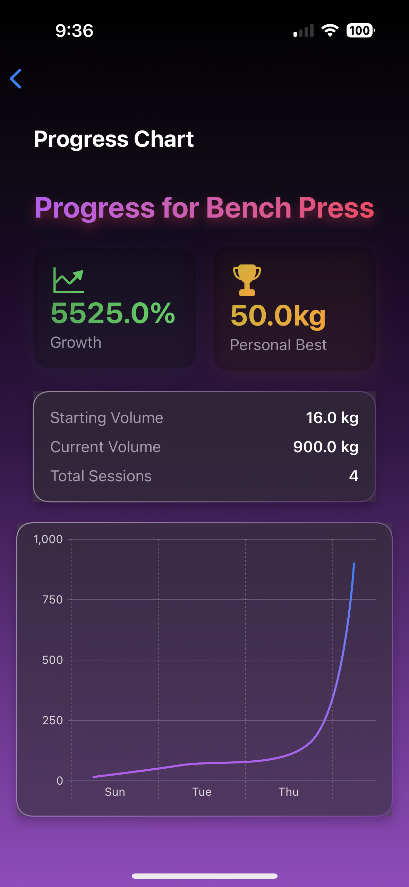

# Gym Partner 🏋️‍♂️

**Gym Partner** is a simple yet powerful iOS app designed to help you track your weightlifting progress. With a clean and intuitive interface, you can log your workouts, view your progress using charts, and stay motivated as you work towards your fitness goals!

---

## Features 🚀

- **Track Workouts**:

  - Log exercises, weights, sets, and reps with ease.
  - Automatically organize workout logs by date.

- **Progress Visualization**:

  - Visualize progress for each exercise with interactive line charts.
  - See trends and improvements over time.

- **Manage Workout Logs**:

  - Swipe left to delete a session.
  - Edit logs for corrections or updates.

- **Customizable Exercises**:
  - Select from predefined exercises or add your own.

---

## Installation 🛠️

### Prerequisites

- macOS with **Xcode 14+** installed.
- A physical or simulated iOS device running **iOS 16+**.
- Basic knowledge of Xcode.

### Steps to Install

1. **Clone the Repository**:

   ```bash
   git clone https://github.com/yourusername/gym-partner.git
   cd gym-partner

   ```

2. **Build and Run:**

# How to Use 📖

### Log a Workout:

1. Tap the `+` button in the top-right corner to add a workout session.
2. Fill in details such as:
   - **Exercise name**
   - **Weight lifted**
   - **Number of sets and reps**
3. Save the workout log to view it in the list.

### View Progress:

1. Tap the **"View Progress"** button to visualize your progress for the selected exercise.
2. Use the dropdown menu to switch between exercises.

### Manage Workouts:

1. Swipe left on a workout log to delete it.
2. Tap on a workout log to view detailed session information.

---

## App Architecture 🏗️

The app is built using modern development principles and frameworks:

### **SwiftUI**:

- Declarative UI framework for creating dynamic, responsive designs.

### **SwiftData**:

- Manages persistent data, such as workout logs, with minimal configuration.

### **Charts Framework**:

- Enables creating beautiful, interactive charts to visualize workout progress.

---

### Key Components

1. **ContentView**:

   - Displays the main dashboard with workout logs, stats, and navigation options.

2. **WorkoutDetailView**:

   - Shows detailed information about a specific workout session.

3. **ProgressView**:

   - Visualizes workout progression for the selected exercise using a line chart.

4. **AddLogView**:

   - Provides a form for adding new workout logs.

5. **Data Model**:
   - **Item**:
     - Represents each workout log, storing details such as:
       - **Exercise name**
       - **Weight lifted**
       - **Sets and reps**
       - **Timestamp of the workout**

---

## Screenshots 📱

| **Home Screen**                      | **Add Workout**                             | **Progress Chart**                                |
| ------------------------------------ | ------------------------------------------- | ------------------------------------------------- |
|  |  |  |

---

## Future Enhancements 🔮

1. Add support for tracking multiple users or profiles.
2. Implement workout recommendations based on past performance.
3. Include calorie estimates for logged workouts.
4. Provide advanced analytics and reports.
5. Add a **Dark Mode** toggle for better usability.

---

## Contributing 🤝

Contributions are welcome! If you'd like to help improve the app, follow these steps:

1. **Fork** the repository.
2. Create a new branch for your feature or bug fix:
   ```bash
   git checkout -b feature/your-feature-name
   ```
3. Commit your changes
4. Push your branch and Open PR on Github

## Acknowledgements 🙌

- **Apple SwiftUI Team** for creating an amazing framework.
- **Charts Framework** for seamless data visualization.
- **Community Support** for feedback and inspiration.

---

## Contact ✉️

If you have any questions, feedback, or feature requests, feel free to reach out:

- **Your Name**: [wshashiraj@gmail.com](mailto:wshashiraj@gmail.com)
- **GitHub**: [ridersw](https://github.com/ridersw)
